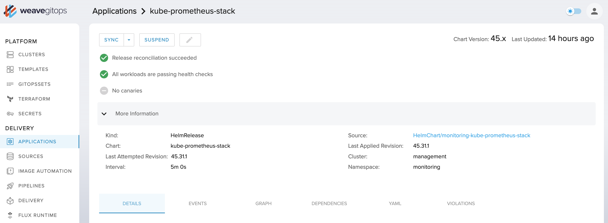
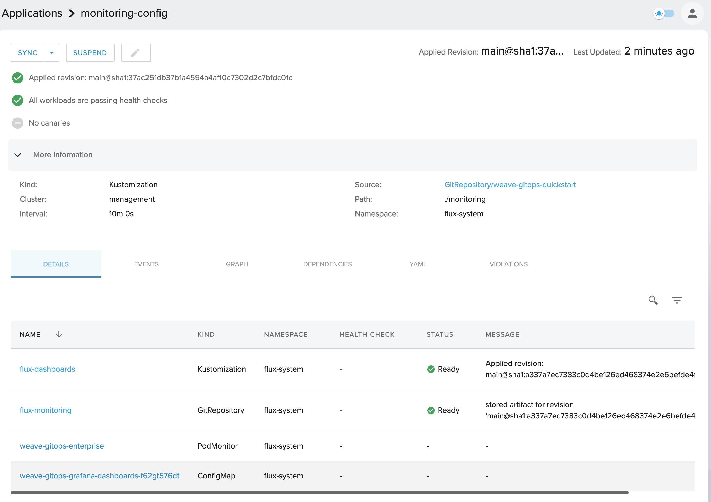
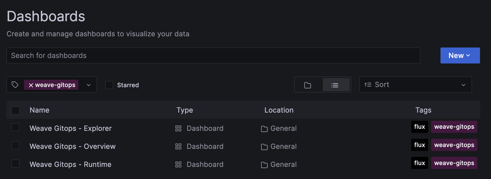

# Monitoring

The monitoring stack is composed of:

- Prometheus
- Grafana
- Kubernetes Dashboards
- Flux Dashboards
- Weave GitOps Grafana dashboards

## Requirements

- You have [Weave GitOps Enterprise](https://www.weave.works/product/gitops-enterprise/) installed on a cluster.

## Getting Started

A simple process to get started, that you could adapt to your context, follows.

1. Install [Kube Prometheus Stack](https://github.com/prometheus-community/helm-charts/tree/main/charts/kube-prometheus-stack) on your cluster.

```yaml
apiVersion: source.toolkit.fluxcd.io/v1
kind: GitRepository
metadata:
  name: weave-gitops-quickstart
  namespace: flux-system
spec:
  interval: 10m0s
  ref:
    branch: main
  url: https://github.com/weaveworks/weave-gitops-quickstart
---
apiVersion: v1
kind: Namespace
metadata:
  name: monitoring
---
apiVersion: kustomize.toolkit.fluxcd.io/v1
kind: Kustomization
metadata:
  name: kube-prometheus-stack
  namespace: flux-system
spec:
  interval: 10m0s
  sourceRef:
    kind: GitRepository
    name: weave-gitops-quickstart
  path: ./monitoring/kube-prometheus-stack
  prune: true
  targetNamespace: monitoring
  wait: true
```



2. Deploy Kustomization having the monitoring config.

```yaml
apiVersion: kustomize.toolkit.fluxcd.io/v1
kind: Kustomization
metadata:
  name: monitoring-config
  namespace: flux-system
spec:
  interval: 10m0s
  sourceRef:
    kind: GitRepository
    name: weave-gitops-quickstart
  path: ./monitoring/weave-gitops
  dependsOn:
    - name: kube-prometheus-stack
  prune: true
  targetNamespace: monitoring
```



3. See the dashboards available in Grafana. 



## Contributing

Just use this repo to open issues and contribute code via pull requests. 

